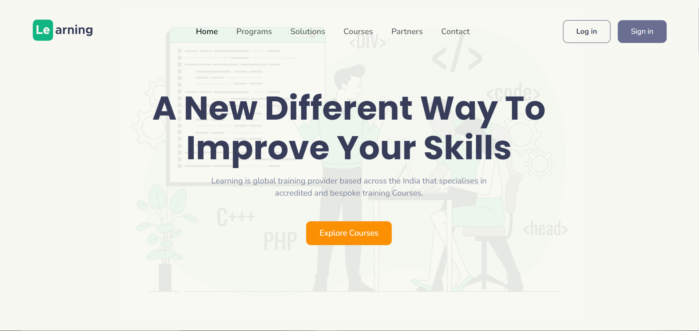

#  Learning - Educational Startup Website

 Learning is global training provider based across the India that
              specialises in 
              accredited and bespoke training Courses.

## Table of contents

- [Overview](#overview)
  - [About tindog](#about-tindog)
  - [Screenshot](#screenshot)
  - [Links](#links)
- [My process](#my-process)
  - [Built with](#built-with)
  - [What I learned](#what-i-learned)
  - [Continued development](#continued-development)
  - [Useful resources](#useful-resources)
- [Author](#author)
- [Acknowledgments](#acknowledgments)


## Overview

### About Learning

A home page website named Learning provides details for thier startup with thier plans and pricing. 
It is a fully responsive website which is built using "Bootstrap" and "CSS Grid".

### Screenshot




### Links


- Live Site URL: [Github Pages](https://saurabh13042004.github.io/Educational-Startup-website/)
- Free Learning Mockups : [Free Learning Mockups](https://drive.google.com/drive/folders/1o3Fl7EeMjH7R4972MrtDvYAzoRodpnI5?usp=sharing)
- Learning Design Link : [Learning Design](https://dribbble.com/shots/16229210-E-learninng-platform-web-landing-page?utm_source=Clipboard_Shot&utm_campaign=suhayelahmednasim&utm_content=E-learninng%20platform%20web%20landing%20page&utm_medium=Social_Share&utm_source=Clipboard_Shot&utm_campaign=suhayelahmednasim&utm_content=E-learninng%20platform%20web%20landing%20page&utm_medium=Social_Share)

## My process

### Built with

- HTML5
- CSS custom properties
- Flexbox
- CSS Grid
- Bootstrap 5
- Javascript


### What I learned
I have learned a lot of things in this project like how to use "Bootstrap" and "CSS Grid".  
I learned about "Media Query Breakpoints", which are used to implement a particular CSS styling on the specific conditions. Like if the screen is bigger than 750px use this set of styling etc.
Tryed to implement some good programming practices :-
1. Readability
2. Modularity
3. Efficiency
4. Length

Some code snippet for fun 😀:

```html
<h1>A New Different Way To Improve Your Skills.</h1>
```
```css
.proud-of-this-css {
  color: studywithLearning;
}
```
```js
const learning = () => {
  console.log('🎉')
}
```


### Continued development

I want to learn more about "CSS Grid" and "Bootstrap" and also want to learn more about "Media Query Breakpoints" and "Refracting a code".


## Author

- Github Profile Link - [Saurabh13042004](https://github.com/Saurabh13042004)
- Linkdin - [@saurabh-shukla](https://www.linkedin.com/in/saurabh-shukla-0b45b3224/)
- Instagram - [@saurabh._shukla._](https://www.instragram.com/saurabh._shukla._ )


## Acknowledgments


I would like to thanks Dribble for providing me the design of the website what a great design it was special thanks to Nasim who made this design. 
I know there are many things that I can improve in this project , but I am happy with the result. If you have any improvements in code feel free to give pull request.

Thanks for reading this far, if you have any suggestions or feedback, please let me know in the comments below. I would love to hear from you.
